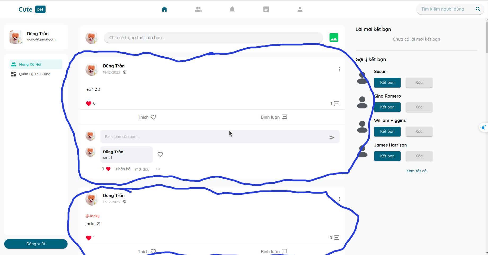
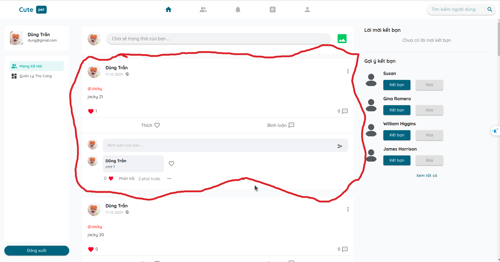
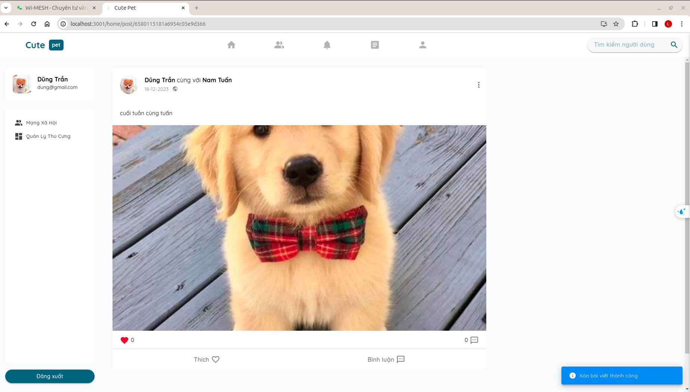
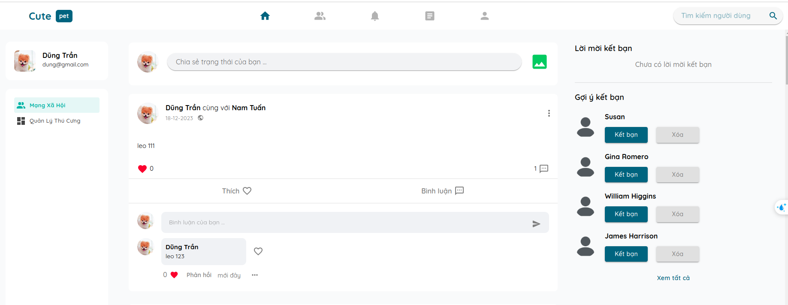
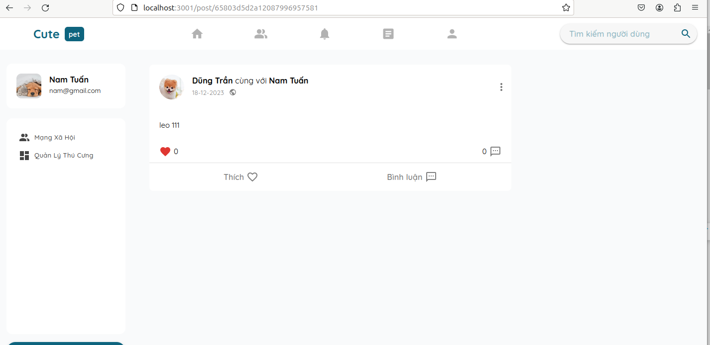
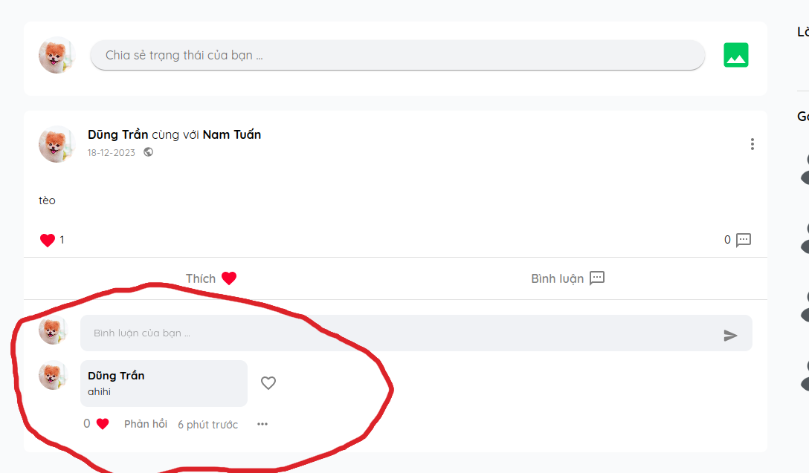
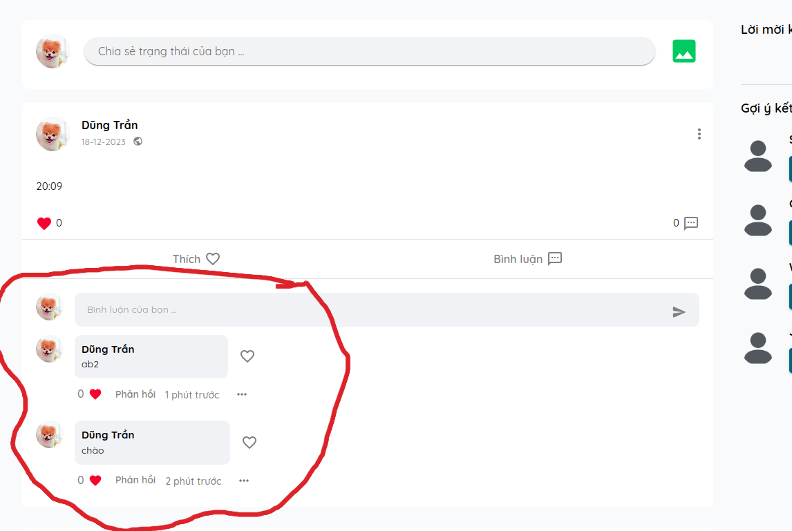

## --DONE-- || ==ERR== 84. khi đã đứng ở trong bài viết chia sẻ trạng thái mà có bấm vào thông báo navigate đến bài viết đó thì không cập nhật lại danh sách mới nhất

`nhớ test lại sau khi fix các bug lớn hơn 100`

`chỉnh mới cập nhật được cmt chưa cập nhật được trạng tahi1 của like với reply với like comment`

<!-- ## 115. ---DONE--- ||==DONE==  đang dứng trong bài viết bấm vào thông báo đến bài viết đó thì không cập nhật cmt với reply mới nhất... trong cả bài status với article

`article ok`
`status chỉnh mới cập nhật được cmt, chưa cập nhật được like reply với like comment` -->

## 122. ---DONE--- ||==ERR==  khi cmt lần đầu tiên ở bài viết status bấm vào thông báo thì không render ra bình luận.

`like cũng sai`

`khi refresh lại trang thì mới render ra được`
`like cmt chưa hiện thực`

## --DONE---||==ERR== 123. khi đang đứng ở bài viết chia sẻ trạng thái A mà bấm vào thông báo để navigate đến bài viết chia sẻ trạng thái B thì nó chỉ hiển thị phần nội dung bài viết còn phần bình luận nó giữ nguyên của bài viết A

`nhớ kiểm tra lại sau khi đã fix 132`

## 124. xóa bài viết status thì comment của bài viết đó nhảy xuống bài nằm lên bài viết ở dưới

`kiểm tra cho cả trường hợp bài viết ở dưới có cmt và không có cmt`

## 125. xóa bài viết trong trang chi tiết bài viết thì nó không biến mất

## 126. khi đang đứng ở bài viết status mà chưa có comment hay like mà bấm vào thông báo comment,like của bài viết đó thì nó vẫn cập nhật

`bấm vào lần đầu tiên không được`

## 127. còn lại comment của bài viết đã xóa trước đó

## 128. chưa cập nhật lại số lượng like của bài viết chia sẻ kiếm thức

## 129. bình luận của bài viết dưới bị đẩy lên trên

## 130. người dùng online ofline có vấn đề, test tầm 2 - 3 lần là nó không hoạt động được nữa

## 131. bật tắt bình luận

## 132. bình luận của bài viết cũ còn nguyên khi đang đứng tại trang chi tiết của bài viết A mà navigate tới bài viết B
