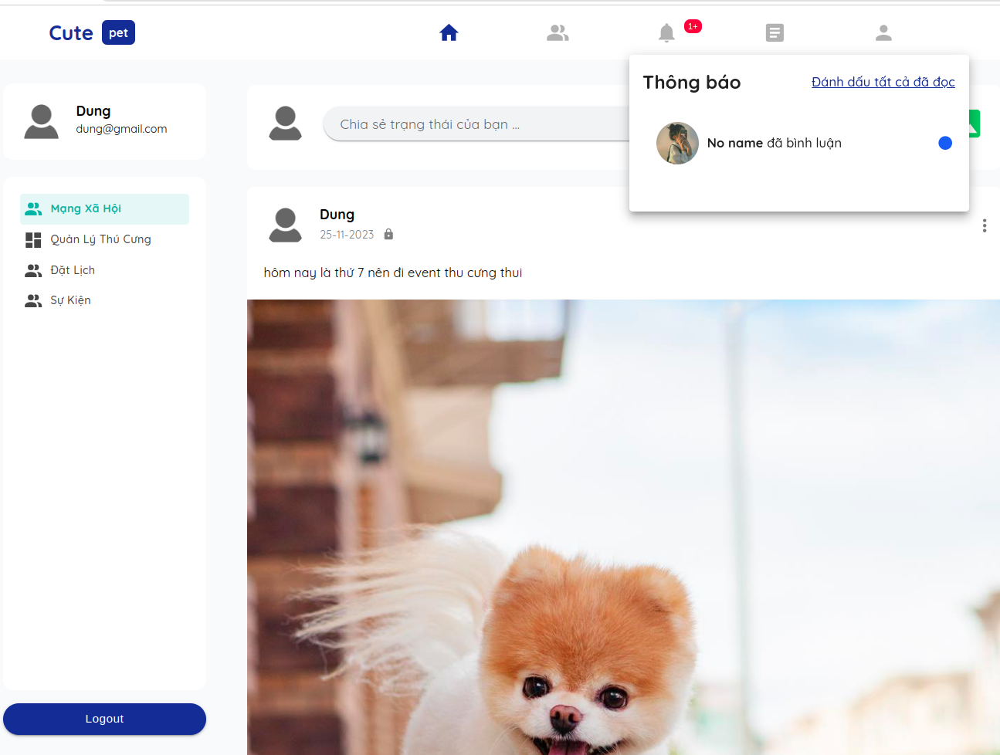
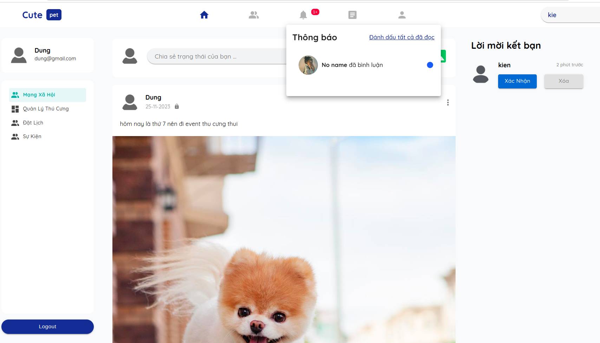
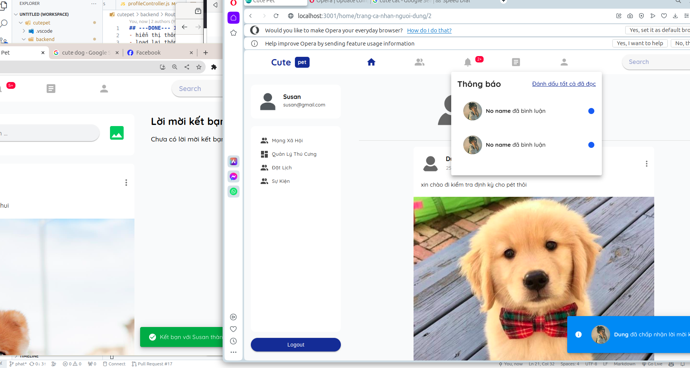
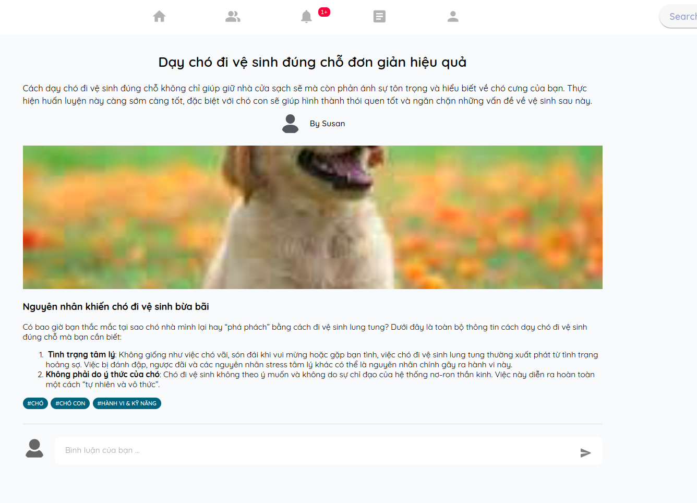
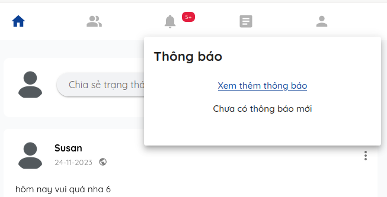

## ---DONE--- || ==ERR== 1. Load lại icon thông báo khi có 1 thông baó mới đến:

- hiển thị thông báo bị xấu khi người dùng không có thông báo => ok
- load lại thông báo khi vào hệ thống chưa đạt
  -nếu thông báo đọc rồi thì xóa nó đi ra khỏi giao diện bằng cách gọi hàm load thông báo chưa đọc
- khi đánh đấu tất cả đã đọc thì xóa số đi

đã có API mới, xem trong postman 69 và 70

## ---DONE--- || ==ERR== 4. handle kết bạn

    `nhớ kiểm tra event listen nha`

- 4.1.thông báo hiển thị chưa chính xác :

- 4.2. chưa handle hiển thị được động lời mời kết bạn động: phải reload lại trang thì mới hiện thị được mục lời mời kết bạn

- 4.3. đã nhận được thông báo chấp nhận lời mời kết bạn socket nhưng chưa hiển thị đúng thông báo

## ---DONE--- || ==ERR== 5. handle người dùng online hay offline động

    `nhớ kiểm tra event listen nha`

- **mới làm online chưa là Ofline**

## ---DONE--- 6. sửa lại hiển thị bài viết trên newsfeed
- chưa bỏ được bài viết trùng

## ---DONE---|| ==ERR== 8. sửa lại icon của bài viết `private`, `public`, `just_friend`

- **chưa sửa trong trang cá nhân của từng người**

## ---DONE--- ||==OK== 12. điều hướng người dung qua trang bài viết khi đăng xong bài viết chia sẻ kiến thức

## --- DONE --- || ==OK== 14. người dùng đã đăng nhập thành công thì chặn vào trang `đăng nhập` và `đăng ký`

- trong trang đăng ký tên phải chỉ chứa tối đa 32 ký tự, có thể là tiếng việt hoặc tiếng anh. [chi tiết tại đây](./userInfor.md#5-đăng-ký-tài-khoản)

## ---DONE--- || ==OK== 16. khi người dùng tag thì phải bỏ đi những người dùng tag rồi tag lại

## ---DONE--- || ==ERR== 25. hiện category lúc đọc bài viết chia sẻ kiến thức

nên hiển thị tag ở **trên** thay vì để ở dưới

## ---DONE--- ||==OK== 27. bật sáng đúng icon article trên navbar lúc đọc bài viết chia sẻ kiến thức, icon bạn bè khi vào danh sách bạn bè, icon thông báo khi bấm vào thông báo

## ---DONE--- ||==ERR== 30. report bài viết chia sẻ kiến thức.

    (xem chi tiến trong summary)

chưa hoàn thành

## 31. report bài viết chia sẻ trạng thái.

    (xem chi tiến trong summary)

## ---DONE---||==OK== 34. Đăng Bài với visibility là bạn bè bị sai

lý do value của visibility là `JUST_FRIENDS` mà lại gửi lên là `friend` nên bị sai không chạy dc

## 35. cập nhật lại giao diện của newfeed khi có 1 bài viết mới được đăng lên

## ---DONE---||==OK== 36. cho phép tag thú cưng của mình vào bài viết chia sẻ trạng thái

## 37. quên text trong riêng bài viết

## 47. xóa bài viết không tồn tại đi

hiển thị 404 page not found khi bài viết không tồn tại

## ---DONE--- || ==OK== 48. xóa lời mời kết bạn cuối cùng đi

## ---DONE--- || ==ERR== 49. lắng nghe khi có ai đó gửi lời mời kết bạn tới

**đã lắng nghe nhưng chưa hiện đúng trên thông báo**

## 50. up vote, downvote bài viết chia sẻ kiến thức, bình luận bài viết chia sẻ kiến thức

## ---DONE --- || ==OK== 51. sai khi đánh dấu đọc thông báo là do truyền sai tham số

## ---DONE--- ||==ERR== 52. Đánh dấu đã đọc tất cả các thông báo

52. chưa reset số lượng thông báo về 0 khi đánh dấu đã đọc tất cả các thông báo
    

## 53. ảnh trong trang cá nhân gặp vấn đề.

## ---DONE---||==OK== 54. search người dùng xong bấm vào không được

## 56. chưa loading bài viết trong trang cá nhân

## 57. tùy vào loại thông báo mà có thể cho phép bấm vào hay không

(viết ra thông báo đó là thông báo nào đừng để noname)

## --- DONE ---||==OK== 58. khi có thông báo mới đến thì load lại API lấy thông báo

## 59. khi có lời mời kết bạn đến thì hiện thị luôn lời mời kết bạn ra luôn

## ---DONE--- ||==OK== 60 follow bài viết trạng thái 

## 61. thích bình luận bài viết chia sẻ trạng thái

## 62. bỏ thích trong phản hồi bài viết trạng thái

## 63. hiện thực upvote và downvote , bình luận, và báo cáo bài viết chia sẻ kiến thức

## 64. xóa thú cưng
