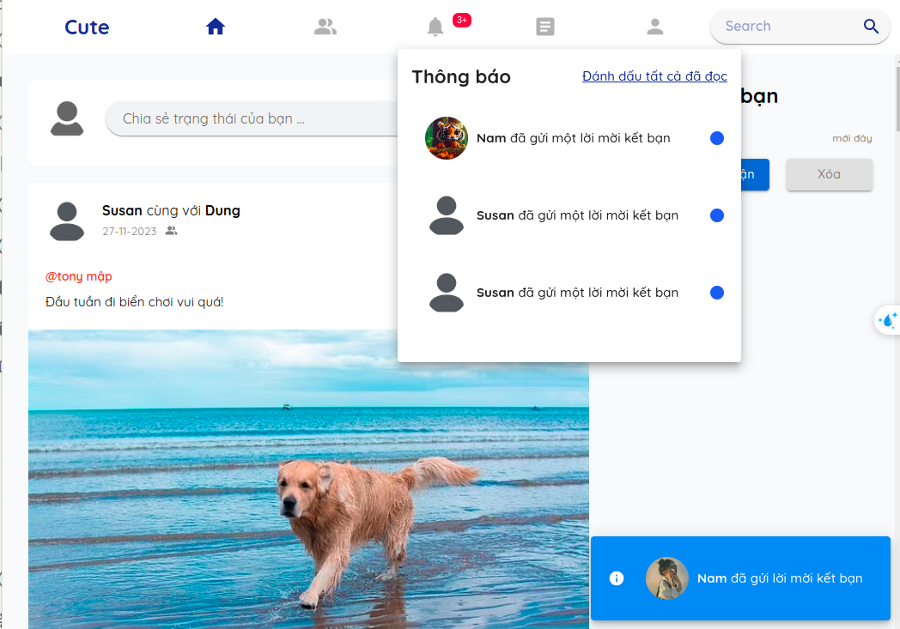
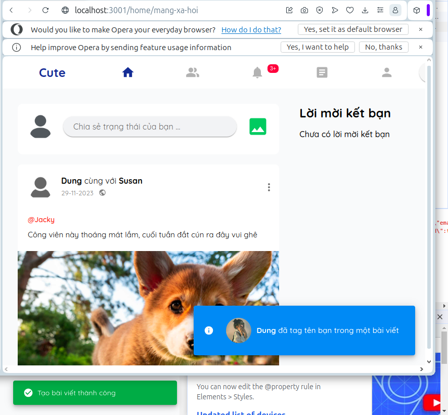
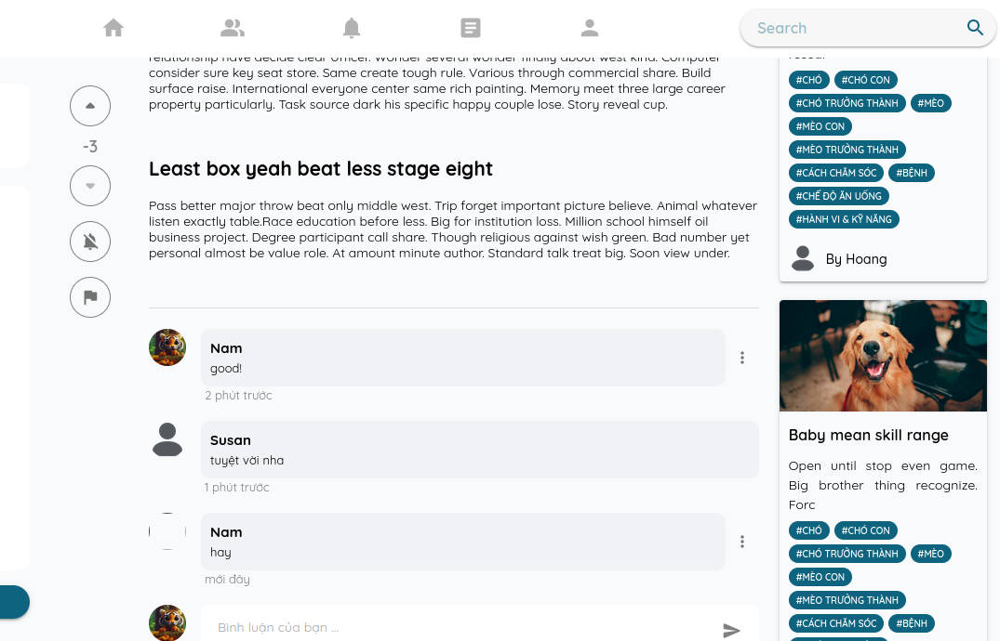

## ---DONE--- ||==ERR== 30. report bài viết chia sẻ kiến thức.

    (xem chi tiến trong summary)

Chỉ report bài viết của người khác, không report bài viết của chính mình

## 31. ---DONE---- || ==OK== report bài viết chia sẻ trạng thái.

    (xem chi tiến trong summary)

## 32. cập nhật lại hàm lấy bài viết trên newFeed

(**thanh kéo trong load hình ảnh bị sai khi số lượng bài viết nhiều**)

[(xem chi tiến trong summary (16-11-2023) mục 5)](./SUMMARY.md#16-11-2023)

    (do backend đã có hàm mới để thay thế cho hàm cũ)

## 33. trang cập nhật thông tin người dùng

1. **yêu cầu:**

- thiết kế:
  Thiếu kế giống như hình sau:

       chia việc cập nhật thông tin người dung ra làm 2 phân riêng biệt:
          +  cập nhật ảnh đại diện
          +  cập nhật thông tin người dùng

  

2. **thực hiện:**

   - cập nhật hình ảnh đại diện của người dùng [chi tiết tại đây](./userInfor.md#3-cập-nhật-ảnh-đại-diện-cho-người-dùng).

   - cập nhật thông tin người dùng [chi tiết tại đây](./userInfor.md#4-cập-nhật-thông-tin-người-dùng).

## ---DONE--- || ==ERR== 35. cập nhật lại giao diện của newfeed khi có 1 bài viết mới được đăng lên

chưa hiện thực được

## ---DONE--- || ==OK== 49. lắng nghe khi có ai đó gửi lời mời kết bạn tới

**ảnh của thông báo góc dưới bên phải không đúng**

## --DONE-- || ==ERR== 50. up vote, downvote bài viết chia sẻ kiến thức, bình luận bài viết chia sẻ kiến thức

số lượng upvote downvote khi nhiều người dùng vote bị sai.

## ---DONE--- || ==ERR== 57. tùy vào loại thông báo mà có thể cho phép bấm vào hay không

(viết ra thông báo đó là thông báo nào đừng để noname)

1.  **LIKE_STATUS_POST** => OK
2.  **COMMENT_STATUS_POST** => OK
3.  **LIKE_COMMENT_IN_STATUS_POST** => thiếu chưa hiện thực
4.  **REPLY_COMMENT_IN_STATUS_POST** => OK
5.  **USER_IS_ONLINE** => chỉ được lần đầu => OK
6.  **USER_IS_OFFLINE** => chỉ được lần đầu => OK
7.  **TAG_USER_IN_STATUS_POST** => OK => ảnh của thông báo góc bên dưới phải chưa đúng
    

8.  **REQUEST_ADD_FRIEND** => OK 

9. **ACCEPT_ADD_FRIEND** => OK 

10. **NEW_STATUS_POST_APPEAR** => chưa hiện thực được
11. **UPVOTE_ARTICLE** => OK
12. **DOWNVOTE_ARTICLE** => OK
13. **COMMENT_ARTICLE** => OK

## --- DONE ---||==OK== 58. khi có thông báo mới đến thì load lại API lấy thông báo

## ---DONE--- || ==OK== 59. khi có lời mời kết bạn đến thì hiện thị luôn lời mời kết bạn ra luôn

khi bấm vào thông báo đã có lời mời kết bạn thì navigate tới trang cá nhân của nguoi2 dùng đó thay vì là bạn bè

- ở ngoài trang home thì có thể xóa hoặc hiển thị ra luôn
  - nếu thiếu xóa ngoài home thì phải tạo trang riêng cho lời mời kết bạn

## 61. thích bình luận bài viết chia sẻ trạng thái

## 62. bỏ thích trong phản hồi bài viết trạng thái

## 64. xóa thú cưng

## 65. thu hồi lời mời kết bạn

tham khảo tại

_chi tiết:_ **[Route_Struture/friend](./friend.md#4-thu-hồi-lời-mời-kết-bạn-xóa-lời-mời-kết-bạn-khi-nó-chưa-được-trả-lời)** và **postman số 68**

## 66. khi xóa bài viết chia sẻ trạng thái thì phải cho nó biến mất trên giao diện

<!-- ## 66. hiện thực like bài viết khi comment trong bài viết chia sẻ kiến thức -->

## 68. khi xóa bài viết cần phải cho bài viết đó biến mất

## 69. con lăn trong mạng xãi hội có vấn đề

## 70. ảnh giao diện của thông báo nhảy ra góc dưới bên phải có vấn đề, trong cả trang mạng xã hội lẫn trang cá nhân

## 70. cần kiểm tra lại tất cả các hình ảnh và tên của thông báo góc bên phải khi socket đến

## ---DONE--- || ==ERR== 72. load bài viết chia sẻ trạng thái theo thú cưng được tags

    **không chạy dc**

## 73. resize lại ảnh trong bài viết của mạng xã hộ cho phù hợp

## 74. trang cập nhật thông tin nguời dùng

## 75. đổi mật khẩu người dùng

## 76. chỉnh sửa bài viết chia sẻ trạng thái

## --DONE--||==OK== 77. chỉnh sửa bài viết chia sẻ kiến thức

## ---DONE---||==OK== 78. xóa bài viết chia sẻ kiến thức

## 79. giao diện gợi ý kết bạn

_chi tiết:_ **[Route_Struture/friend.md](./friend.md#5-lấy-danh-sách-người-dùng-gợi-ý-kết-bạn)** và **postman số 74**

## 80. thông báo khi không thêm được thú cưng (ở chỗ ngày sinh)

<!-- ## 81. quên mật khẩu -->

## 82. sửa lại trang đăng ký thông báo lỗi khi mật khẩu

## 83. khi đứng tại trang cá nhân của 1 người khác mà nhận được thông báo lời mời kết bạn rồi bấm vào thì chỉ có phần trên thay đổi còn phần dưới thì không.

## 84. khi đã đứng ở trong bài viết chia sẻ trạng thái mà có bấm vào thông báo navigate đến bài viết đó thì không cập nhật lại danh sách mới nhất

## 85. khi comment bài viết chia sẻ kiến thức thì hình không cập nhật ở chỗ comment

## 86. hiển thị trả lời bình luận bị ngược

## 