## --DONE-- || ==DONE== 84. khi đã đứng ở trong bài viết chia sẻ trạng thái mà có bấm vào thông báo navigate đến bài viết đó thì không cập nhật lại danh sách mới nhất

`chỉnh mới cập nhật được cmt chưa cập nhật được trạng tahi1 của like với reply với like comment`

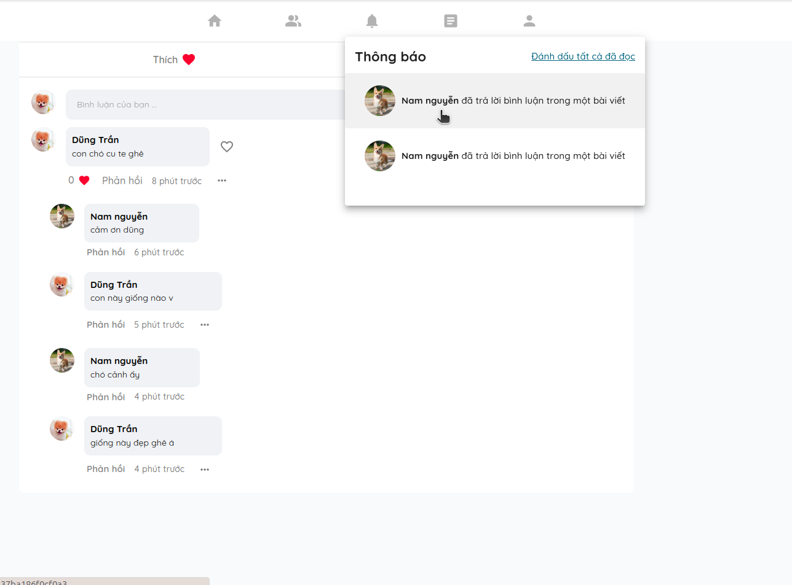

## 115. ---DONE--- ||==DONE==  đang dứng trong bài viết bấm vào thông báo đến bài viết đó thì không cập nhật cmt với reply mới nhất... trong cả bài status với article

`article ok`
`status chỉnh mới cập nhật được cmt, chưa cập nhật được like reply với like comment`

## --DONE--- 119. nên sửa lại cái khung lọc thể loại ở trang bài viết chia sẻ kiến thức

`nên cho chiều dài bằng với chiều dài của các bộ lọc tác giả, thời gian`

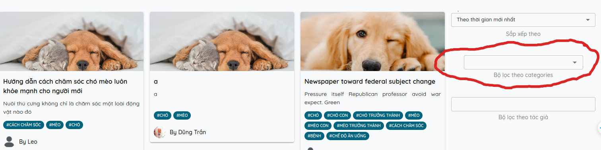

## ---DONE--- 120. sau khi xóa bài viết và đăng lại bài viết mới thì cái bài viết cập nhật trên giao diện bị sai

`bài viết hihihi này đã bị xóa nhưng khi đăng bài mới lên thì nó vẫn in ra giao diện`

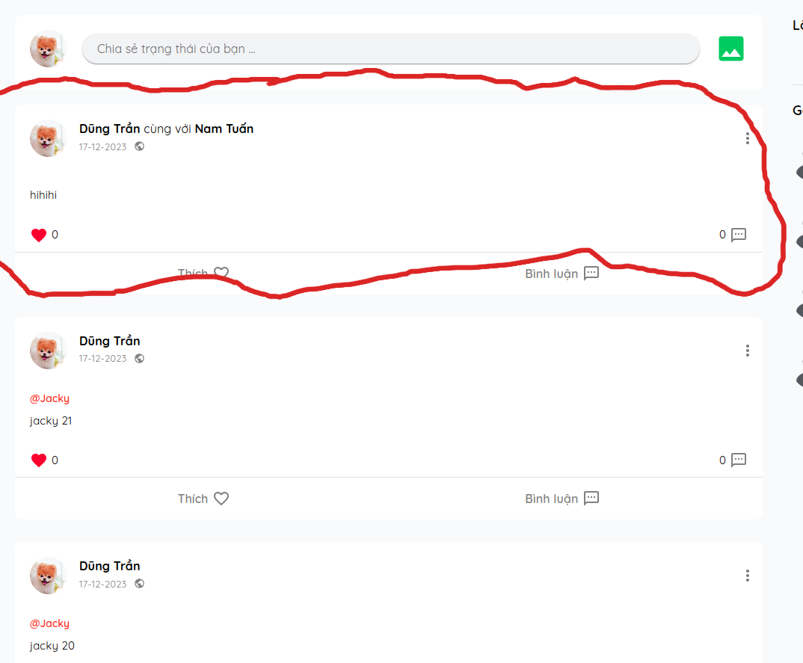

`thông tin socket gửi đúng. Bài viết phải là bug 1 mới đúng`

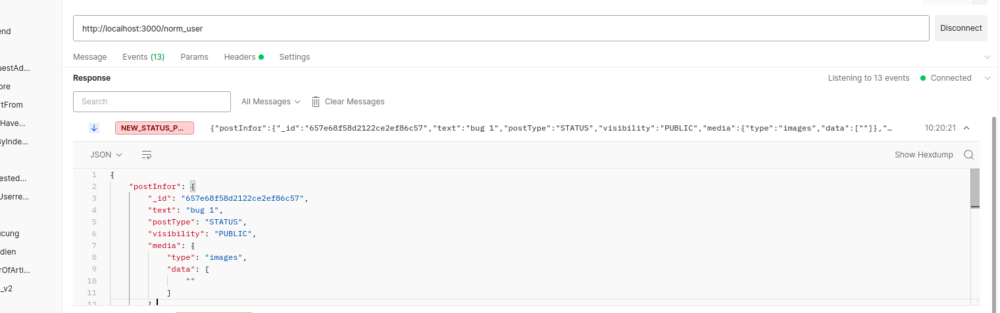

## --DONE-- 121. khi dứng ở trang 404 bấm vào thông báo thì không navigate đến bài viết đó

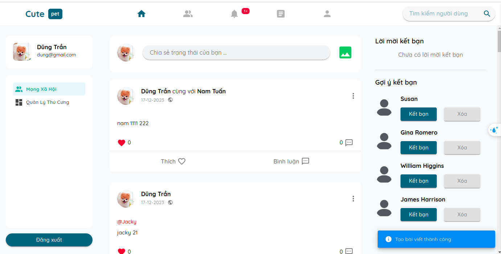
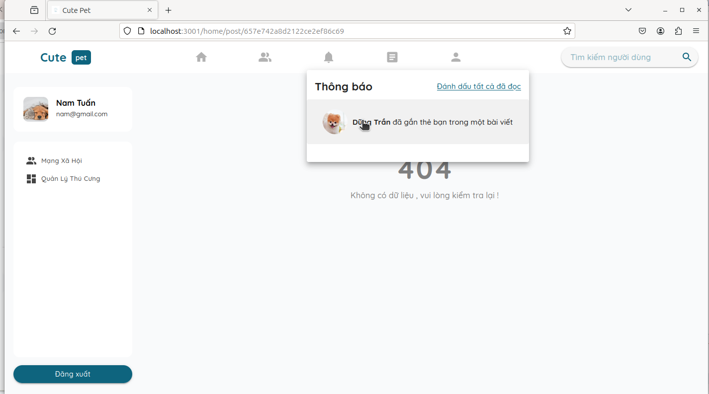

## ---DONE--- 122. khi cmt lần đầu tiên ở bài viết status bấm vào thông báo thì không render ra bình luận.

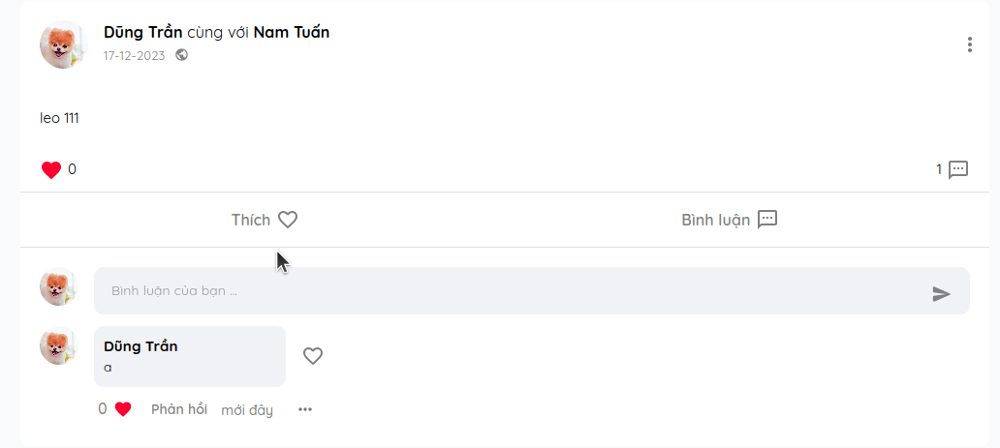
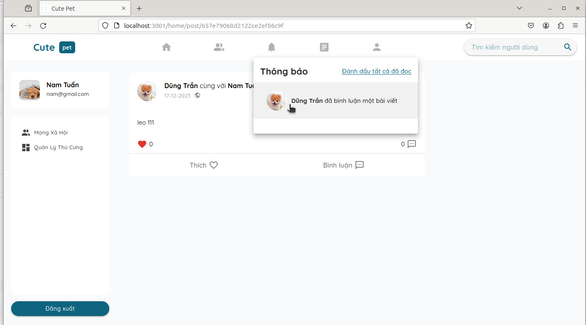

`like cũng sai`
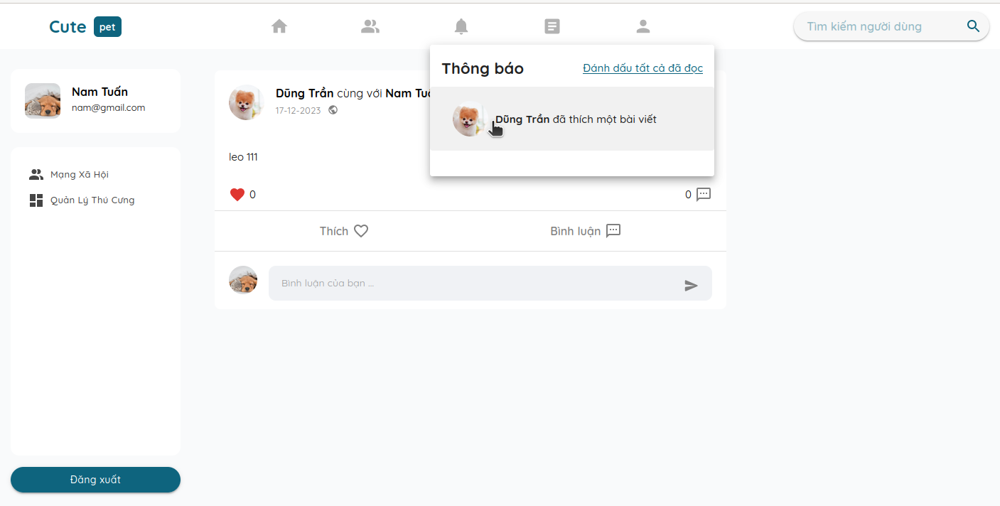

`khi refresh lại trang thì mới render ra được`
`like cmt chưa hiện thực`
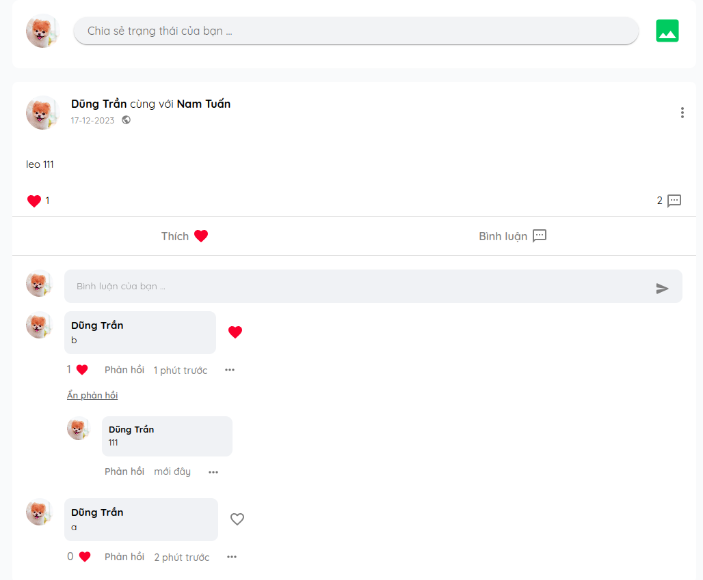
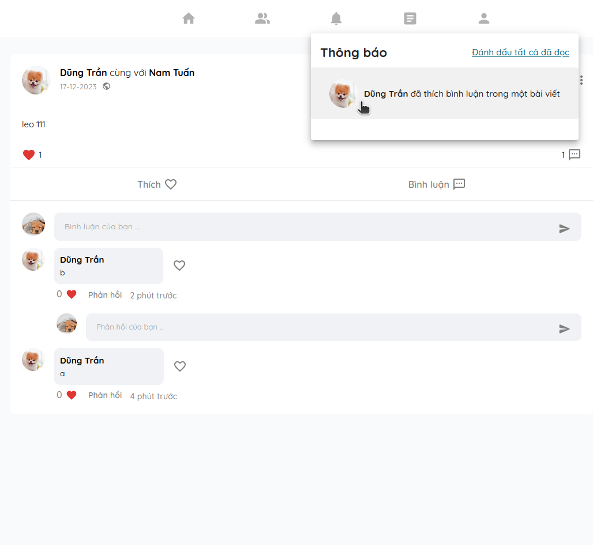

## --DONE--- 123. khi đang đứng ở bài viết chia sẻ trạng thái A mà bấm vào thông báo để navigate đến bài viết chia sẻ trạng thái B thì nó chỉ hiển thị phần nội dung bài viết còn phần bình luận nó giữ nguyên của bài viết A

`kiểm tra tương tự cho article`

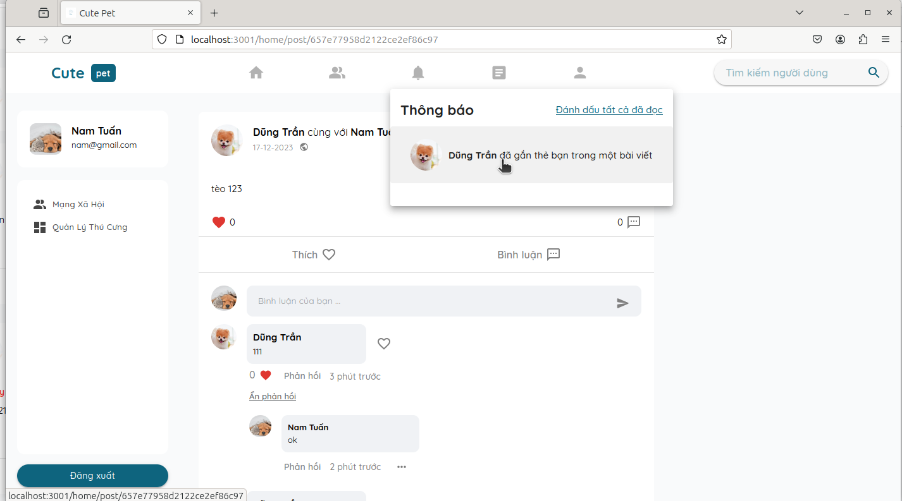

