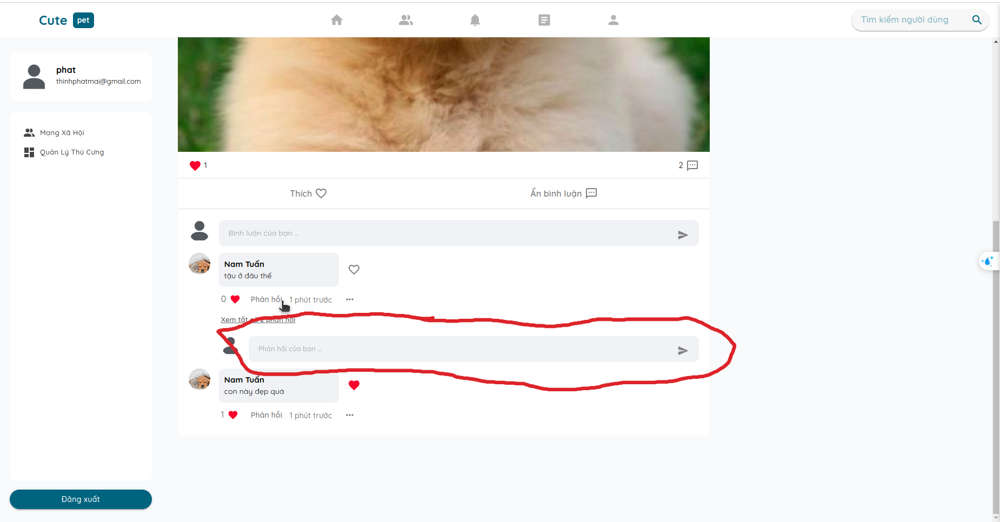
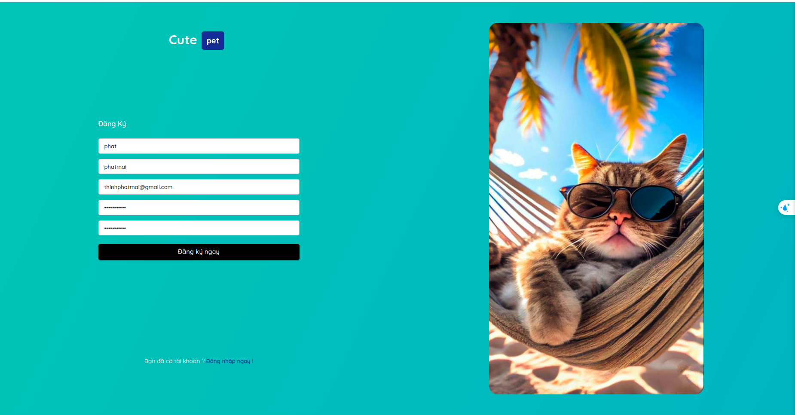
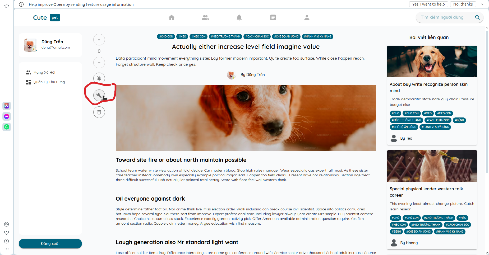
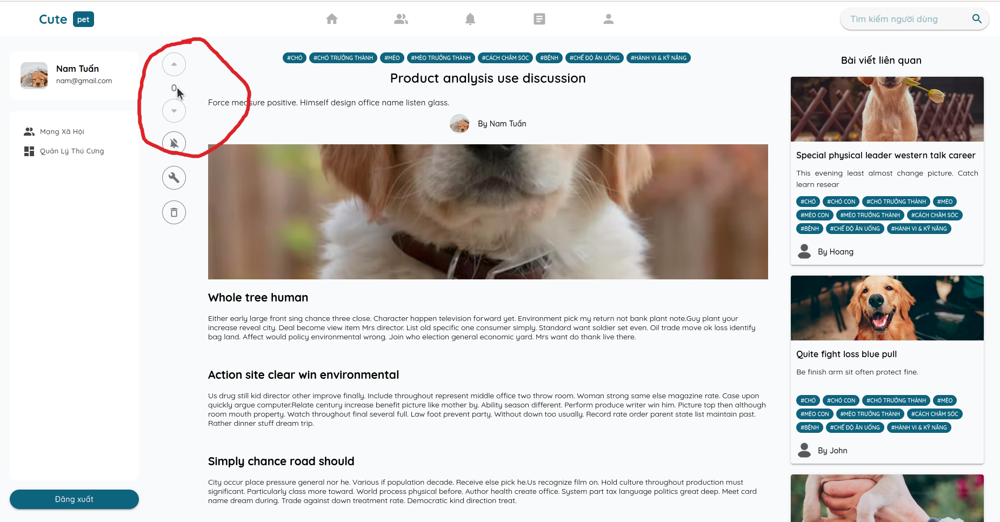
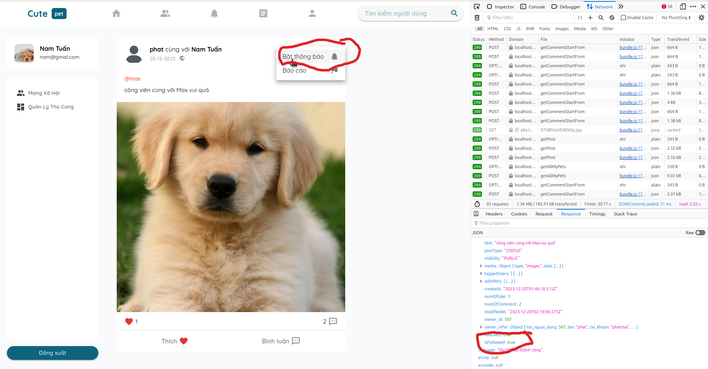

## 133.==OK==  cho phép tắt thanh phản hồi bình luận trong bài viết chia sẻ trạng thái
`chưa chạy được`

## 134.==OK==  sau khi đăng ký xong thì hiểu thị ra đoạn text thông báo kiểm tra email để kích hoạt tài khoản thay vì hiển thị form đăng ký

## 135. ==OK== nếu có thể thì làm luôn hover vào icon thì hiện ra text trong bài viết chia sẻ kiến thức

## 136.==OK==  điểm của bài viết chia sẻ kiến thức chưa cập nhật được khi có thông báo upvote và downvote

## 137.==OK==  hiển thị sai bật tắt thông báo trong trang chi tiết của bài viết status 

## 138. ==OK== chỉnh sửa ảnh đại diện cho thú cưng

## 139 ==OK == Fix ảnh đại diện update thú cưng
## 140. ==OK == Fix logo navigate

## 141. ==OK== thêm tootip
`Downvote viết liền giống Upvote`

## 142. ==OK== Sửa thanh search

## 143. ==OK== Fix bài viết của tôi

## 144. ==OK== Số lượng cmt, thời gian, điểm trung bình. article