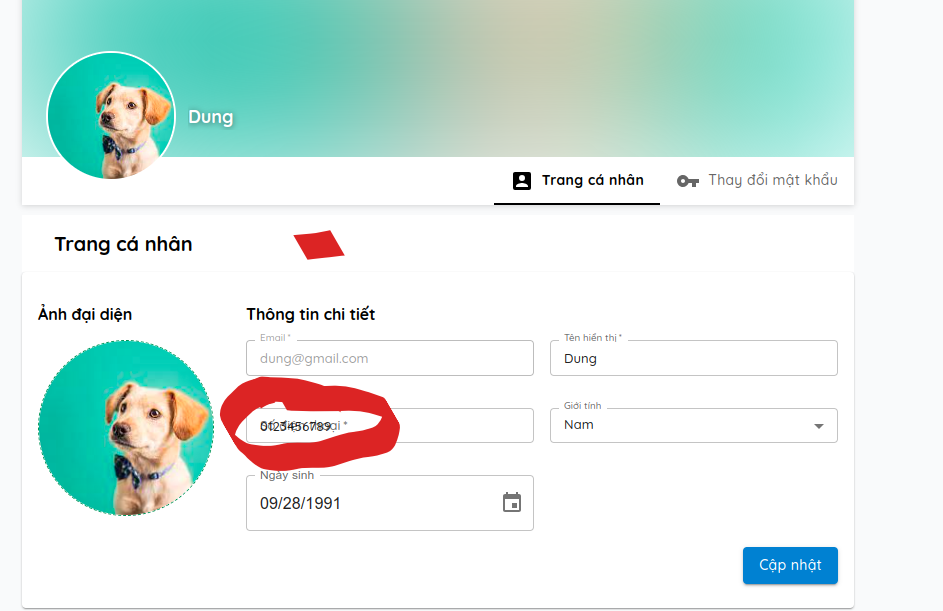

## ---DONE--- ||==DONE== 30. report bài viết chia sẻ kiến thức.

    (xem chi tiến trong summary)

Chỉ report bài viết của người khác, không report bài viết của chính mình

## 31. ---DONE---- || ==OK== report bài viết chia sẻ trạng thái.

    (xem chi tiến trong summary)

## 33. --DONE-- trang cập nhật thông tin người dùng

1. **yêu cầu:**

- thiết kế:
  Thiếu kế giống như hình sau:

       chia việc cập nhật thông tin người dung ra làm 2 phân riêng biệt:
          +  cập nhật ảnh đại diện
          +  cập nhật thông tin người dùng

  

2. **thực hiện:**

   - cập nhật hình ảnh đại diện của người dùng [chi tiết tại đây](./userInfor.md#3-cập-nhật-ảnh-đại-diện-cho-người-dùng).

   - cập nhật thông tin người dùng [chi tiết tại đây](./userInfor.md#4-cập-nhật-thông-tin-người-dùng).

## 61.---DONE---||==OK== thích bình luận bài viết chia sẻ trạng thái

## 62.---DONE--- bỏ thích trong phản hồi bài viết trạng thái

## 64. ---DONE--- xóa thú cưng

## 65.---DONE--- thu hồi lời mời kết bạn

tham khảo tại

_chi tiết:_ **[Route_Struture/friend](./friend.md#4-thu-hồi-lời-mời-kết-bạn-xóa-lời-mời-kết-bạn-khi-nó-chưa-được-trả-lời)** và **postman số 68**

## 66. --DONE---||==OK== khi xóa bài viết chia sẻ trạng thái thì phải cho nó biến mất trên giao diện

<!-- ## 66. hiện thực like bài viết khi comment trong bài viết chia sẻ kiến thức -->

## ---DONE--- ||==DONE== 68. khi xóa bài viết cần phải cho bài viết đó biến mất
Biến mất cả ở trong trang chi tiết của bài viết

## ---DONE--- || ==DONE== 72. load bài viết chia sẻ trạng thái theo thú cưng được tags

   thông tin về người chủ và bài viết không chính xác, do BE quên trả về thông tin người dùng nên là sai => đã sửa lại ở BE => cập nhật lại.

## 74. ---DONE--- || ==ERR== trang cập nhật thông tin nguời dùng
sai ở cái chỗ số điện thoại 

## ---DONE---||== DONE == 76. chỉnh sửa bài viết chia sẻ trạng thái
thiếu nút ấn chỉnh sửa khi vào bài viết trang chi tiết của bài viết chia sẻ trạng thái.

## --DONE--- 80. thông báo khi không thêm được thú cưng (ở chỗ ngày sinh)

## ---DONE--- || ==DONE== 83. khi đứng tại trang cá nhân của 1 người khác mà nhận được thông báo lời mời kết bạn rồi bấm vào thì chỉ có phần trên thay đổi còn phần dưới thì không.

chưa tet được do tự động điều hướng sang trang cá nhân khi muốn vào trang bạn bè

## ---DONE--- || ==DONE== 72. load bài viết chia sẻ trạng thái theo thú cưng được tags

   thông tin về người chủ và bài viết không chính xác, do BE quên trả về thông tin người dùng nên là sai => đã sửa lại ở BE => cập nhật lại.

## --DONE-- 84. khi đã đứng ở trong bài viết chia sẻ trạng thái mà có bấm vào thông báo navigate đến bài viết đó thì không cập nhật lại danh sách mới nhất

## --DONE--- Xem sét lại có sửa ko --- 86. hiển thị trả lời bình luận bị ngược

(tham khảo ý kiến của cô)

## ---DONE--- 87. khi vào trang của bạn bè thì tự động điều hướng sang trang cá nhân

## ---DONE--- 88. khi bấm vào con thú thì thông tin chủ nhân của nó bị sai backend đã sửa lại API cũ

chi tiết: **[Route_Struture/pet.md](./post.md#18-lấy-bài-viết-có-tag-con-thú-cụ-thể)** và **postman số 71**

## ---DONE--- 89. them6 trang chi tiết thú cưng.

## ---DONE--- 90. thêm đoạn mô tả ở flag cả ở trang mạng xã hội lẫn chia sẻ kiến thức

## ---DOEN--- 91. sửa lại state khi cập nhật.

## --DONE--- 92. chấp nhận hay xóa lời mời kết bạn khi đã bị thu hồi.

## --DONE-- 94. phản hồi bình luận phải theo thứ tự thời gian

## ----DONE---- 95. thú cưng của mình thì mới dc xóa còn của bạn bè là chỉ xem thôi.

## ---DONE--- 96. làm trang chi tiết thú cưng, có loading .

## ---DONE---- 97. khi xem chi tiết của 1 bài viết, nếu là người chủ thì phải cho họ có thể chỉnh sửa hoặc xóa bài viết đó.

## --DONE-- 98. khi đăng bài viết chia sẻ trạng thái mà không nhập gì thì báo lỗi và bắt người dùng nhập thông tin bài viết

## --DONE-- 99. chặn người dùng vào trang edit bài viết không phải của mình

## ---DONE-- 100. cho phép chỉnh sửa khi ở trang chi tiết của bài viết nếu ta là chủ

## 101. load thêm hình luận.

## ---DONE--- 102. khi nhận được thông báo chưa gửi lời mời kết bạn đến người dùng khác thì tắt giao diện thu hồi lời mời kết bạn đi

## ---DONE--- 103. đứng tại trang của thú cưng này bấm vào con thú cưng kia thì chỉ có phần bài viết thay đổi còn phần thông tin phía trên thì không thay đổi.

## ---DONE--- 104. thiếu phần theo dõi ở chỗ bài viết của mình trạng thái

## ---DONE--- 105. chỉnh sửa thú cưng bị lỗi chỗ ngày sinh khi để ngày sinh là giống với ban đầu
**sai do truyền vào ngày sinh mặc định cả giờ phút giây**

## 106. hàm trả về ngươi dùng trong thanh tìm kiếm bị thiếu

## ---DONE--- 107. đang đứng ở trang cá nhân của người dùng khác bấm vào trang cá nhân của người dùng khác nữa thì giao diện bị đảo ngược

## ---DONE --- 108. xử lý giao diện khi thu hồi lời mời không tồn tại.

## --DONE--- 109. giao diện sai chính tả

**cả trang đăng ký  đăng nhập nữa nha**

## --DONE--- 110. load bình luận trong bài viết trạng thái có phân trang
## ---DONE-- 110. load bình luận trong Chia sẻ kiến thức trạng thái có phân trang
## --Chưa có API hoặc trong struct a chưa thấy--- 111. search người dùng phân trang
## --DONE --- 112. Khi đang dứng ở trang cá nhân của người dùng và tìm kiếm người dùng khác thì bị lỗi chỗ ảnh người dùng ở bài viết.

**cách giải quyết:** khi bấm vào người dùng => load toàn bộ lại thông tinh giống như nhập mã người dùng vào *url*

## ---DONE--- 113. khi bài viết có 2 con thú cưng đang đứng ở trang của con thú này mà chọn con thú kia thì chỉ có phần bài viết thay đổi còn phần thông tin phía trên thì không thay đổi.

**cách giải quyết:** khi bấm vào thú cưng => load toàn bộ lại thông tinh giống như nhập mã thú cưng vào *url*

## ---DONE-- 114. ngày sinh nếu không có hoặc sai thì không nên để invalid date mà nên để trống

