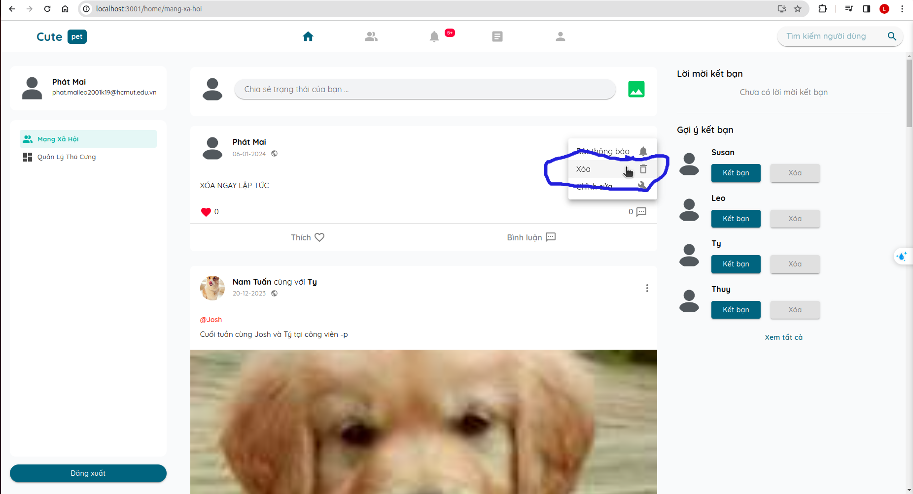

## 145. ==OK== Kết bạn tại trang chủ bằng gợi ý kết bạn  sau đó KHÔNG CHUYỂN SANG TAB KHÁC, KHÔNG RELOAD LẠI TRẠNG và đăng bài thì trong danh sách bạn bè không có bạn bè mới kết bạn

`Phát Mai đứng tại trang chủ kết bạn với Dũng Trần và chờ Dũng Trần đồng ý. Vẫn đứng tại trang chủ không di chuyển đến tab khác, không reload lại trang cho đến khi được đồng ý kết bạn`

`Tương tự cho đứng tại trang chủ chấp nhận lời mời kết bạn mà không di chuyển đến tab khác, thì danh sách bạn bè mới nhấn vấn chưa được cập nhật`

`Sau khi được đồng ý kết bạn, Phát Mai đăng trạng thái tag bạn bè thì không thấy có Dũng Trần trong danh sách bạn bè ở phần tag bạn bè`

## 146. ==ERR== khi đăng một status không có hình ảnh và bài viết ngay dưới đó có hình ảnh thì khi chỉnh sửa status ở trên hình ảnh bên dưới sẽ tự động nhảy lên phần chỉnh sửa.

`đăng một status không có hình ảnh ngay dưới đó là một status có hình ảnh (của bất kỳ ai), `

`Khi bấm vào chỉnh sửa status không có hình ảnh ở trên thì hình ảnh ở bên dưới sẽ tự động nhảy lên phần chỉnh sửa`

## 147. ==OK== khi tên và email quá dài sẽ lấn sang phần tương tác của bài viết chia sẻ kiến thức

## 148. ==OK== và trang cá nhân của người khác kết bạn sau đó về trang chủ đang status có tag người bạn đó và ngày sau đó edit tag bạn bè trong status thì danh sách bạn bè của phần tag không có người đó

`1. vào trang cá nhân của người dùng khác để gửi lời mời kết bạn và chờ cho đến khi được đồng ý rồi quay lại trang chủ đăng status và tag người dùng đó`

`2. chờ cho đến khi đươc đồng ý kết bạn, không reload lại trang, mà quay lại trang chủ đăng status có tag bạn bè mới đó`

`3. bấm vào chỉnh sửa và tiến hình edit tag bạn bè thì không xuất hiện người dùng mới đó`

`không còn người dùng mới trong danh sách`

## 149 ==OK== bài viết đăng xong xóa ở trang mạng xã hội chưa được xóa trong trang cá nhân

`1. đăng một bài viết ở trang mạng xã hội và ngay lập tức xóa bài viết đó`

`2. tuy nhiên trong trang cá nhân thì vẫn còn bài viết đó`

