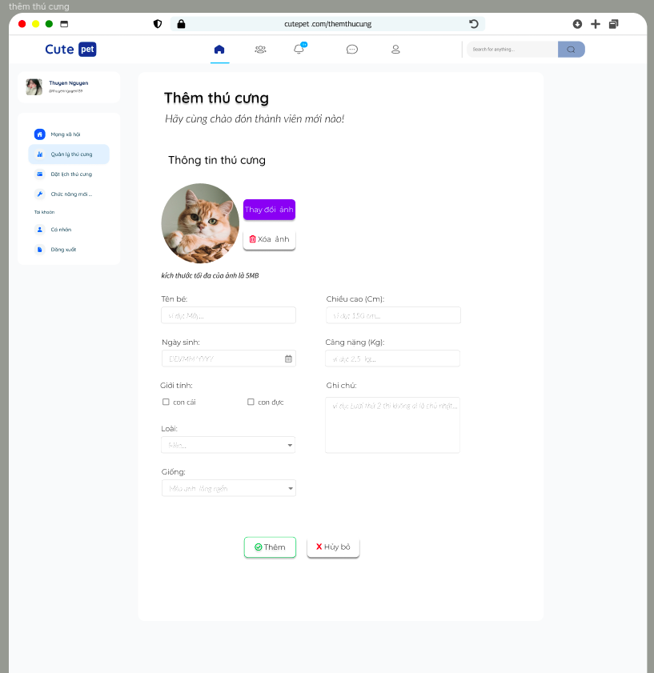

## ---DONE--- ||==OK== 1. Load lại icon thông báo khi có 1 thông baó mới đến:

- hiển thị thông báo bị xấu khi người dùng không có thông báo => ok
- load lại thông báo khi vào hệ thống chưa đạt
  -nếu thông báo đọc rồi thì xóa nó đi ra khỏi giao diện bằng cách gọi hàm load thông báo chưa đọc
- khi đánh đấu tất cả đã đọc thì xóa số đi

đã có API mới, xem trong postman 69 và 70

## ---DONE--- || ==OK== 4. handle kết bạn

## ---DONE--- || ==OK== 5. handle người dùng online hay offline động => Kiểm tra lại socket backend

    `nhớ kiểm tra event listen nha`

- **mới làm online chưa là Ofline**

## ---DONE--- || ==OK== 6. sửa lại hiển thị bài viết trên newsfeed

- chưa bỏ được bài viết trùng

## ---DONE---|| ==OK== 8. sửa lại icon của bài viết `private`, `public`, `just_friend`

- **chưa sửa trong trang cá nhân của từng người**

## ---DONE--- ||==OK== 12. điều hướng người dung qua trang bài viết khi đăng xong bài viết chia sẻ kiến thức

## --- DONE --- || ==OK== 14. người dùng đã đăng nhập thành công thì chặn vào trang `đăng nhập` và `đăng ký`

- trong trang đăng ký tên phải chỉ chứa tối đa 32 ký tự, có thể là tiếng việt hoặc tiếng anh. [chi tiết tại đây](./userInfor.md#5-đăng-ký-tài-khoản)

## ---DONE--- || ==OK== 16. khi người dùng tag thì phải bỏ đi những người dùng tag rồi tag lại

## ---DONE---||==OK== 25. hiện category lúc đọc bài viết chia sẻ kiến thức

nên hiển thị tag ở **trên** thay vì để ở dưới

## ---DONE--- ||==OK== 27. bật sáng đúng icon article trên navbar lúc đọc bài viết chia sẻ kiến thức, icon bạn bè khi vào danh sách bạn bè, icon thông báo khi bấm vào thông báo

## ---DONE--- ||==ERR== 30. report bài viết chia sẻ kiến thức.

    (xem chi tiến trong summary)

chưa hoàn thành

## 31. ---DONE---- || ==OK== report bài viết chia sẻ trạng thái.

    (xem chi tiến trong summary)

## 32. cập nhật lại hàm lấy bài viết trên newFeed

(**thanh kéo trong load hình ảnh bị sai khi số lượng bài viết nhiều**)

[(xem chi tiến trong summary (16-11-2023) mục 5)](./SUMMARY.md#16-11-2023)

    (do backend đã có hàm mới để thay thế cho hàm cũ)

## 33. trang cập nhật thông tin người dùng

1. **yêu cầu:**

- thiết kế:
  Thiếu kế giống như hình sau:

       chia việc cập nhật thông tin người dung ra làm 2 phân riêng biệt:
          +  cập nhật ảnh đại diện
          +  cập nhật thông tin người dùng

  

2. **thực hiện:**

   - cập nhật hình ảnh đại diện của người dùng [chi tiết tại đây](./userInfor.md#3-cập-nhật-ảnh-đại-diện-cho-người-dùng).

   - cập nhật thông tin người dùng [chi tiết tại đây](./userInfor.md#4-cập-nhật-thông-tin-người-dùng).

## ---DONE---||==OK== 34. Đăng Bài với visibility là bạn bè bị sai

lý do value của visibility là `JUST_FRIENDS` mà lại gửi lên là `friend` nên bị sai không chạy dc

## ---DONE--- || ==ERR== 35. cập nhật lại giao diện của newfeed khi có 1 bài viết mới được đăng lên

chưa hiện thực được

## ---DONE---||==OK== 36. cho phép tag thú cưng của mình vào bài viết chia sẻ trạng thái

## ---DONE---||==OK== 37. quên text trong riêng bài viết

## --- DONE--- || ==OK== 47. xóa bài viết không tồn tại đi

hiển thị 404 page not found khi bài viết không tồn tại

## ---DONE--- || ==OK== 48. xóa lời mời kết bạn cuối cùng đi

## ---DONE--- || ==ERR== 49. lắng nghe khi có ai đó gửi lời mời kết bạn tới

**ảnh của thông báo góc dưới bên phải không đúng**

## 50. up vote, downvote bài viết chia sẻ kiến thức, bình luận bài viết chia sẻ kiến thức

## ---DONE --- || ==OK== 51. sai khi đánh dấu đọc thông báo là do truyền sai tham số

## ---DONE--- || ==OK== 52. Đánh dấu đã đọc tất cả các thông báo

52. chưa reset số lượng thông báo về 0 khi đánh dấu đã đọc tất cả các thông báo
    

## ---DONE --- || ==OK== 53. ảnh trong trang cá nhân gặp vấn đề.

## ---DONE---||==OK== 54. search người dùng xong bấm vào không được

## ---DONE --- ||==OK== 56. chưa loading bài viết trong trang cá nhân

## ---DONE--- || ==ERR== 57. tùy vào loại thông báo mà có thể cho phép bấm vào hay không

(viết ra thông báo đó là thông báo nào đừng để noname)

1.  **LIKE_STATUS_POST** => OK
2.  **COMMENT_STATUS_POST** => OK
3.  **LIKE_COMMENT_IN_STATUS_POST** => thiếu chưa hiện thực
4.  **REPLY_COMMENT_IN_STATUS_POST** => OK
5.  **USER_IS_ONLINE** => chỉ được lần đầu => OK
6.  **USER_IS_OFFLINE** => chỉ được lần đầu => OK
7.  **TAG_USER_IN_STATUS_POST** => ERR=> ảnh của thông báo góc bên dưới phải chưa đúng 

1.  **REQUEST_ADD_FRIEND** => ERR=> ảnh của thông báo góc bên dưới phải chưa đúng

9. **ACCEPT_ADD_FRIEND** => ERR=>ảnh của thông báo góc bên dưới phải chưa đúng

10. **NEW_STATUS_POST_APPEAR** => chưa hiện thực được
11. **UPVOTE_ARTICLE** => chưa hiện thực được
12. **DOWNVOTE_ARTICLE** => chưa hiện thực được
13. **COMMENT_ARTICLE** => chưa hiện thực được

## --- DONE ---||==OK== 58. khi có thông báo mới đến thì load lại API lấy thông báo

## ---DONE--- || ==OK== 59. khi có lời mời kết bạn đến thì hiện thị luôn lời mời kết bạn ra luôn

khi bấm vào thông báo đã có lời mời kết bạn thì navigate tới trang cá nhân của nguoi2 dùng đó thay vì là bạn bè

- ở ngoài trang home thì có thể xóa hoặc hiển thị ra luôn
  - nếu thiếu xóa ngoài home thì phải tạo trang riêng cho lời mời kết bạn

## ---DONE--- ||==OK== 60 follow bài viết trạng thái

## 61. thích bình luận bài viết chia sẻ trạng thái

## 62. bỏ thích trong phản hồi bài viết trạng thái

## 63. hiện thực upvote và downvote , bình luận, và báo cáo bài viết chia sẻ kiến thức

## 64. xóa thú cưng

## 65. thu hồi lời mời kết bạn

tham khảo tại

_chi tiết:_ **[Route_Struture/friend](./friend.md#4-thu-hồi-lời-mời-kết-bạn-xóa-lời-mời-kết-bạn-khi-nó-chưa-được-trả-lời)** và **postman số 68**

## 66. khi xóa bài viết chia sẻ trạng thái thì phải cho nó biến mất trên giao diện

## 66. hiện thực like bài viết khi comment trong bài viết chia sẻ kiến thức

## 68. khi xóa bài viết cần phải cho bài viết đó biến mất

## 69. con lăn trong mạng xãi hội có vấn đề

## 70. ảnh giao diện của thông báo nhảy ra góc dưới bên phải có vấn đề, trong cả trang mạng xã hội lẫn trang cá nhân

## 70. cần kiểm tra lại tất cả các hình ảnh và tên của thông báo góc bên phải khi socket đến

## 72. load bài viết chia sẻ trạng thái theo thú cưng được tags

## 73. resize lại ảnh trong bài viết của mạng xã hộ cho phù hợp

## 74. trang cập nhật thông tin nguời dùng

## 75. đổi mật khẩu người dùng

## 76. chỉnh sửa bài viết chia sẻ trạng thái

## 77. chỉnh sửa bài viết chia sẻ kiến thức

## 78. xóa bài viết chia sẻ kiến thức

## 79. giao diện gợi ý kết bạn

##
