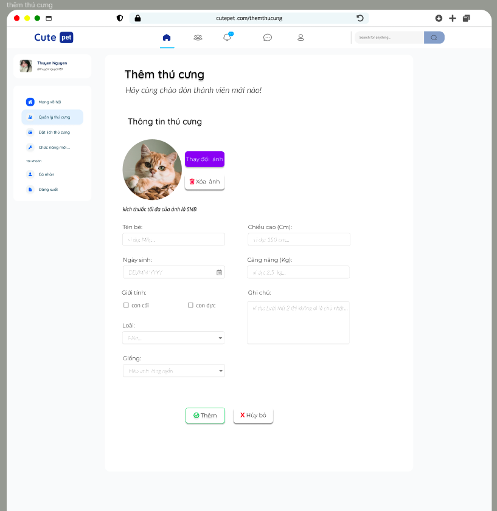
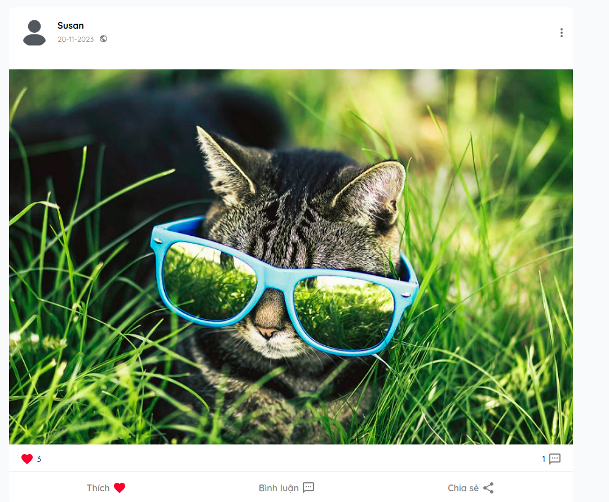
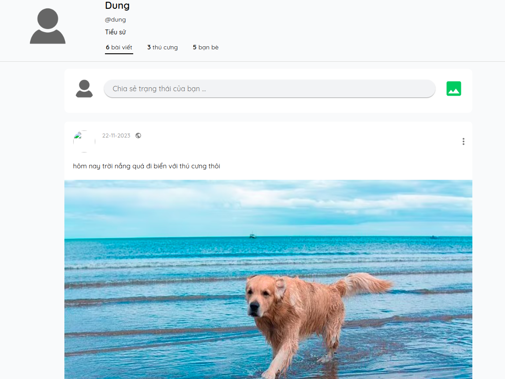
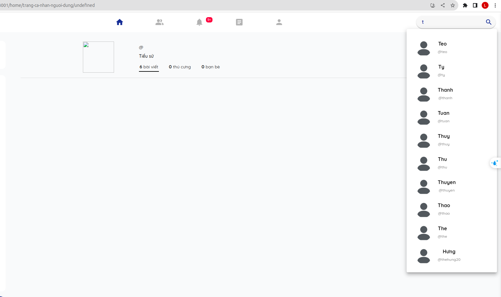

# các yêu cầu cần hoàn thành:

## 1. ==OK== Load lại icon thông báo khi có 1 thông baó mới đến:

    - [ ] 1.1. khi có 1 thông báo mới đến thì icon thông báo sẽ được load lại
    - [ ] 1.2. khi mới đăng nhập vào hệ thống phải load lại trang thông báo
    - [ ] 1.3 nếu thông báo đọc rồi thì xóa nó đi có api rồi ko hiện thị, nếu thông báo dến thì load lại icon thông báo và api để cập nhật

sửa dụng: - **[getNotificationBefore](./notification.md/#1-get-notifications-before-specific-time)** hoặc **[getNotificationStartFrom](./notification.md/#2-get-notifications-by-index-and-range)**

## 2. Làm trang profile cá nhân:

    - [ ] 2.1. trang cá nhân cho mình
    - [ ] 2.2 trang cá nhân cho người dùng cụ thể

sửa dụng:

- **[1](./profile.md/#1-lấy-thông-tin-trang-cá-nhân-của-chính-mình)**
- **[2](./profile.md/#2-lấy-các-bài-viết-trên-time-line-của-chính-mình-cho-trang-cá-nhân)**
- **[3](./profile.md/#3-lấy-thông-tin-trang-cá-nhân-của-người-dùng-khác)**
- **[4](./profile.md/#4-lấy-các-bài-viết-trên-time-line-của-người-dùng-khác)**

## 3. ==OK== đổi lại icon cho bài viết chia sẻ:

## 4. ==OK== handle kết bạn

    `nhớ kiểm tra event listen nha`

## 5. ==OK== handle người dùng online hay offline động

    `nhớ kiểm tra event listen nha`

## 6. ==OK== sửa lại hiển thị bài viết trên newsfeed

    `bài viết trạng thái hiển thị khác với bài viết chia sẻ kiến thức`

## 7. ==OK== thêm trường theo dõi bài viết và bỏ theo dõi bài viết vào mục tùy chọn trong bài viết

`(tính năng này cho cả chia sẻ kiến thức và trạng thái)`

## 8. ==OK== sửa lại icon của bài viết `private`, `public`, `just_friend`

## 9. == OK == socket có vấn đề :

    - [ ] 9.1. đăng xuất chưa tắt socket
    - [ ] 9.2. khi đăng nhập vào thì socket chưa được kết nối

## 10. navigate tới mạng xã hội khi path là `/` hoặc là `/home`

## 11. ==OK== hoàn thiện ảnh trong trang chia sẻ kiến thức:

    - [ ] 11.1 resize lại
    - [ ] 11.2 cho hủy ảnh

## 12. ==OK== điều hướng người dung qua trang bài viết khi đăng xong bài viết chia sẻ kiến thức

## 13. `upvote`, `downvote` và `comment` khi vào bài viết chia sẻ kiến thức

tham khảo tại: **[article.md](./article.md)**

## 14. ==OK== người dùng đã đăng nhập thành công thì chặn vào trang `đăng nhập` và `đăng ký`

- trong trang đăng ký tên phải chỉ chứa tối đa 32 ký tự, có thể là tiếng việt hoặc tiếng anh. [chi tiết tại đây](./userInfor.md#5-đăng-ký-tài-khoản)

## 15. ==OK== thêm icon xóa ảnh khi đăng bài viết chia sẻ trạng thái

## 16. ==OK== khi người dùng tag thì phải bỏ đi những người dùng tag rồi tag lại

## 17. đổi mật khẩu người dùng

    (xem trong file summary)

## 18. == OK == Sửa lại thông báo trong trang đăng nhập :

    - thông báo rõ ràng hơn lỗi đó là lỗi gì không nên để chung chung là lỗi đăng nhập được:

 - vd: không nhập mật khẩu, không nhập tài khoản, thông tin đăng nhập không chính xác

## 19. Thêm tính năng chỉnh sửa bài viết chia sẻ trạng thái

    (xem trong file summary)

## 20. ==OK== sửa lại danh sách các thể loại của bài viết chia sẻ kiến thức

    (xem trong file summary)

## 21. thêm tính năng đổi mật khẩu cho người dung

    (xem trong file summary)

## 22. thêm tính năng chỉnh sửa bài viết chia sẻ trạng thái

    (xem trong file summary)

## 23. ==OK== thêm nút xóa ảnh khi đăng bài trạng thái

## 24. ==OK== resize lại ảnh khi đăng bài viết chia sẻ kiến thức

## 25. ==OK== hiện category lúc đọc bài viết chia sẻ kiến thức

## 26. ==OK== đổi lại icon article trên navbar

## 27.==OK== bật sáng đúng icon article trên navbar lúc đọc bài viết chia sẻ kiến thức, icon bạn bè khi vào danh sách bạn bè, icon thông báo khi bấm vào thông báo

## 28. handle ảnh bìa cho bài viết chia sẻ kiến thức

        (chỉnh lại cho đẹp hơn)

## 29. chỉnh sửa bài viết chia sẻ kiến thức.

    (xem chi tiến trong summary)

## 30. report bài viết chia sẻ kiến thức.

    (xem chi tiến trong summary)

## 31. ==OK== report bài viết chia sẻ trạng thái.

    (xem chi tiến trong summary)

## 32. cập nhật lại hàm lấy bài viết trên newFeed

(**thanh kéo trong load hình ảnh bị sai khi số lượng bài viết nhiều**)

[(xem chi tiến trong summary (16-11-2023) mục 5)](./SUMMARY.md#16-11-2023)

    (do backend đã có hàm mới để thay thế cho hàm cũ)

## 33. trang cập nhật thông tin người dùng

1. **yêu cầu:**

- thiết kế:
  Thiếu kế giống như hình sau:

       chia việc cập nhật thông tin người dung ra làm 2 phân riêng biệt:
          +  cập nhật ảnh đại diện
          +  cập nhật thông tin người dùng

  

2. **thực hiện:**

   - cập nhật hình ảnh đại diện của người dùng [chi tiết tại đây](./userInfor.md#3-cập-nhật-ảnh-đại-diện-cho-người-dùng).

   - cập nhật thông tin người dùng [chi tiết tại đây](./userInfor.md#4-cập-nhật-thông-tin-người-dùng).

## 34. ---OK--- Đăng Bài với visibility là bạn bè bị sai

lý do value của visibility là `JUST_FRIENDS` mà lại gửi lên là `friend` nên bị sai không chạy dc

## 35. cập nhật lại giao diện của newfeed khi có 1 bài viết mới được đăng lên

xem chi tiết tại: **[Route_Struture/socket.md](./socket.md#10-thông-báo-khi-có-bài-viết-status-mới-được-đăng-lên)**

## 36. --OK-- cho phép tag thú cưng của mình vào bài viết chia sẻ trạng thái

xem chi tiết tại: **[Route_Struture/post.md](./post.md#1-thêm-bài-viết-chia-sẻ-trạng-thái)**

## 37. Load bài viết status khi vào trang mạng xã hội

## 38. khi đăng xuất thông báo xanh xanh vẫn còn chưa kịp tắt đi

## 39. thêm tính năng thêm bạn bè trong lúc tìm kiếm bạn bè

## 40. chờ phản hồi khi tìm kiếm bạn bè

## 41. hủy lời mời kết bạn

Hủy xóa lời mời kết bạn khi lời mời đã dc gửi đi nhưng chưa có phản hồi xem chi tiết tại: **[thu hồi lời mời kết bạn](./friend.md#4-thu-hồi-lời-mời-kết-bạn-xóa-lời-mời-kết-bạn-khi-nó-chưa-được-trả-lời)**

## 42. hủy bạn bè

## 43. --OK-- chưa show text trong bài viết chia sẻ trạng thái khi bam61 vào thông báo

## 44. thích bài viết chia sẻ trạng thái

## 45. lắng nghe khi có ai đó thích bài viết chia sẻ trạng thái

## 46. lắng nghe khi phản hồi bình luận của bài viết chia sẻ trạng thái

## 47. ==OK== xóa bài viết không tồn tại đi

## 48. xóa lời mời kết bạn cuối cùng đi

## 49. lắng nghe khi có ai đó gửi lời mời kết bạn tới

## 50. up vote, downvote bài viết chia sẻ kiến thức, bình luận bài viết chia sẻ kiến thức

## 51. --OK-- sai khi đánh dấu đọc thông báo là do truyền sai tham số

## 52. ==OK== Đánh dấu đã đọc tất cả các thông báo

## 53. --OK-- ảnh trong trang cá nhân gặp vấn đề.

## 54. ==OK== search người dùng xong bấm vào không được

## 56. ==OK== chưa loading bài viết trong trang cá nhân

## 57. tùy vào loại thông báo mà có thể cho phép bấm vào hay không

(viết ra thông báo đó là thông báo nào đừng để noname)

## 58. --OK-- khi có thông báo mới đến thì load lại API lấy thông báo

## 59. --OK-- khi có lời mời kết bạn đến thì hiện thị luôn lời mời kết bạn ra luôn

## 60. --OK-- follow bài viết trạng thái

## 61. thích bình luận bài viết chia sẻ trạng thái

## 62. bỏ thích trong phản hồi bài viết trạng thái

## 63. hiện thực upvote và downvote , bình luận, và báo cáo bài viết chia sẻ kiến thức

## 64. xóa thú cưng

## 65. thu hồi lời mời kết bạn

tham khảo tại

_chi tiết:_ **[Route_Struture/friend](./friend.md#4-thu-hồi-lời-mời-kết-bạn-xóa-lời-mời-kết-bạn-khi-nó-chưa-được-trả-lời)** và **postman số 68**

## 66. khi xóa bài viết chia sẻ trạng thái thì phải cho nó biến mất trên giao diện

## 66. hiện thực like bài viết khi comment trong bài viết chia sẻ kiến thức

## 68. khi xóa bài viết cần phải cho bài viết đó biến mất

## 69. con lăn trong mạng xãi hội có vấn đề

## 70. ảnh giao diện của thông báo nhảy ra góc dưới bên phải có vấn đề, trong cả trang mạng xã hội lẫn trang cá nhân

## 70. cần kiểm tra lại tất cả các hình ảnh và tên của thông báo góc bên phải khi socket đến

## 72. load bài viết chia sẻ trạng thái theo thú cưng được tags

## 73. resize lại ảnh trong bài viết của mạng xã hộ cho phù hợp

## 74. trang cập nhật thông tin nguời dùng

## 75. đổi mật khẩu người dùng

## 76. chỉnh sửa bài viết chia sẻ trạng thái

## 77. chỉnh sửa bài viết chia sẻ kiến thức

## 78. xóa bài viết chia sẻ kiến thức

## 79. giao diện gợi ý kết bạn

_chi tiết:_ **[Route_Struture/friend.md](./friend.md#5-lấy-danh-sách-người-dùng-gợi-ý-kết-bạn)** và **postman số 74**

##

##

##

##

##

##
